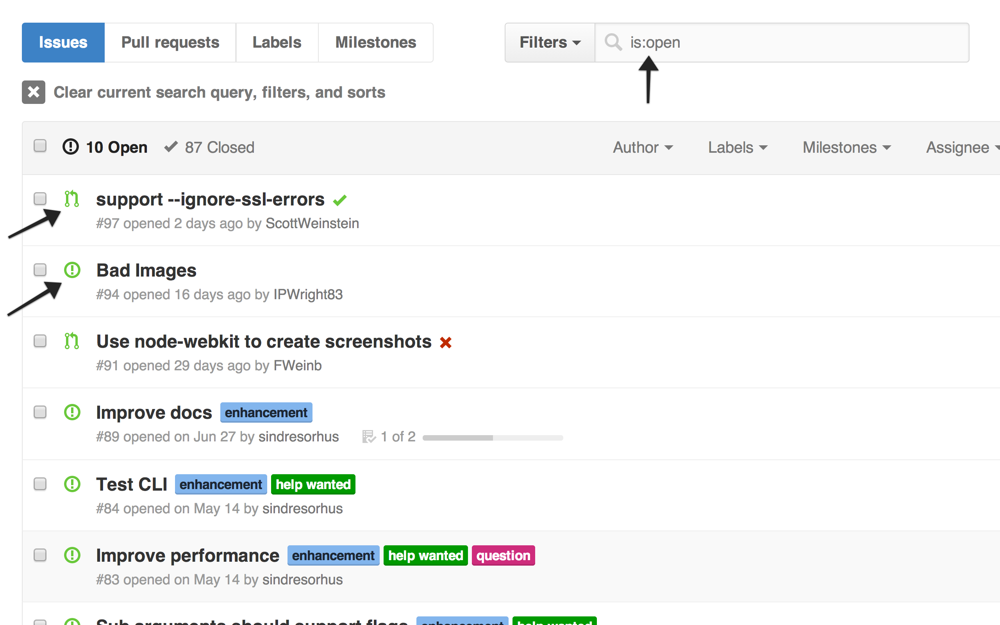

# GitHub Issues All

> Chrome extension - Show both Issues and Pull Requests in the Issues tab by default. As it previously did.

## Install

[Get it on the Chrome Web Store.](https://chrome.google.com/webstore/detail/github-issues-all/ahkcgmpcfiijldaijfjekdffckpidieb)

## License

MIT © [Sindre Sorhus](http://sindresorhus.com)
